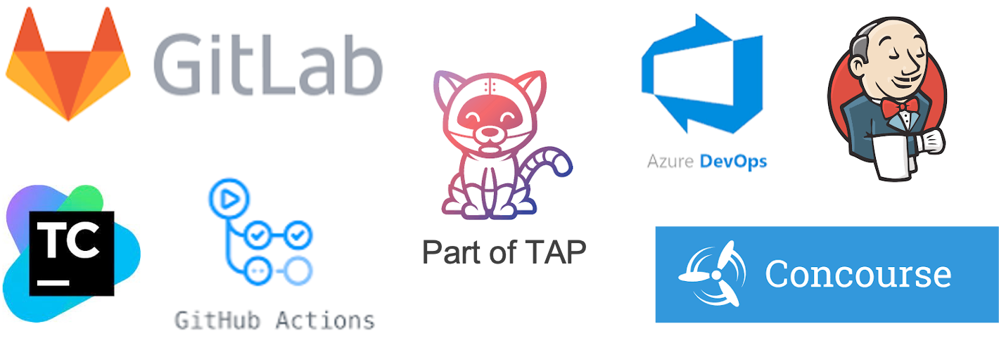

To handle the more complex deployment and operations of modern applications, there is a need for a culture change towards **DevSecOps**, a buzzword for improved collaboration between developers, security, and operations teams.
This collaboration should be **supported by automated processes**, like a self-service for developers to get access to the tools they need.

The automated process of testing and deploying applications them into production is called **Continuous Integration** and **Continuous Delivery** (CI/CD). 

The CI/CD tools universe is always in flux, but most solutions pose the same challenges.  

#### Challenges of most of the current CI/CD Tools
- They use an **orchestration model** where the orchestrator executes, monitors, and manages each of the steps of the path to production **synchronously**. If, for example, a path to production has a vulnerability scanning step, and a new CVE should arise, the only way to scan the code for it would be to trigger the orchestrator to initiate the scanning step or a new run through the supply chain.
- **A different path to production for each of the applications**. Even if all the pipelines are based on one template, it's hard to update all of them if the template changes.
- **No Separation of concerns** between the users and authors of the pipeline.
- The **developer experience is lacking**.

#### Introducing Cartographer - A Supply Chain Choreographer for Kubernetes


VMware Tanzu Application Platform uses the open-source Cartographer that allows developers to focus on delivering value to their users and provides operators the assurance that all code in production has passed through all the steps of a pre-approved path to production.

```dashboard:open-url
url: https://cartographer.sh
```

##### Design and Philosophy

Cartographer allows operators via the **Supply Chain** abstraction to define all of the steps that an application must go through in a path to production, like container image creation or CVE scanning.

Because steps of the path to production are rarely synchronous, **Cartographer uses the choreography instead of the orchestration model**, where each step of the path to production and the tool required for that **step knows nothing about the next step**. It is **responsible for receiving a signal that it must perform some work, completing it, and signaling that it has finished**. In the same case as above, with a pipeline that has a vulnerability scanner, if there is a new CVE, the vulnerability scanner would know about it and trigger a new scan. When the scan is complete, the vulnerability scanner will send a message indicating that the scanning is completed.

###### Reusable CI/CD
By design, **a supply chain can be used by many workloads of a specific type**, like any web application. This allows an operator to specify the steps in the path to production a single time and for developers to specify their applications independently but for each to use the same path to production.


To enable app operators to consistently apply runtime configurations to fleets of workloads of a specific type implemented in different technologies, [Cartographer Conventions](https://github.com/vmware-tanzu/cartographer-conventions) is a related project. 

###### Kubernetes Resource Interoperability
With Cartographer, it's possible to choreograph Kubernetes and non-Kubernetes resources within the same supply chain via **integrations to existing CI/CD tools** like [Tekton](https://tekton.dev).

###### Separation of Concerns
While the supply chain is operator-facing, Cartographer also provides an **interface for developers** called **Workload**. Workloads allow developers to pass information about an application, such as the location of their repository, environment variables, etc., to be delivered through the supply chain.
```editor:open-file
file: ~/samples/workload.yaml
```

#### Configure a Continuous Path to Production for an Application

In addition to the name of the Workload, there is also `app.kubernetes.io/part-of` label with the same value, which is [recommend](https://kubernetes.io/docs/concepts/overview/working-with-objects/common-labels/) and used by some tooling.

The location of an application's source code can be configured via the `spec.source` field. Here, we are using a branch of a Git repository as a source to be able to implement a **continuous path to production** where every git commit to the codebase will trigger another execution of the supply chain, and developers only have to apply a Workload once if they start with a new application or microservice. 
For the to-be-deployed application, the Workload custom resource also provides configuration options for a **pre-built image in a registry** from e.g. an ISV via `spec.image`.

Other configuration options are available for resource constraints (`spec.limits`, `spec.requests`) and environment variables for the build resources in the supply chain (`spec.build.env`) and to be passed to the running application (`spec.env`).

Last but not least via (`.spec.params`), it's possible to override default values of the additional parameters that are used in the Supply Chain but not part of the official Workload specification.

There are more configuration options available which you can have a look at in the detailed specification here:
```dashboard:open-url
url: https://cartographer.sh/docs/v0.7.0/reference/workload/
```

If developers have, like in our case, access to a namespace in the Kubernetes cluster the supply chain is available, they can use the **kubectl CLI** to apply a Workload.
```terminal:execute
command: kubectl apply -f samples/workload.yaml
clear: true
```

Another option would be to apply the Workload via **GitOps**.

GitOps is an operational model that uses Git repositories as a single source of truth to version and store infrastructure configuration. The configuration is pulled continuously by tools like in this case [kapp-controller](https://carvel.dev/kapp-controller/) or [Flux](https://fluxcd.io) to ensure the infrastructure is correctly configured.

The benefit of using this operational model for the Workload is that **developers don't need access to the Kubernetes cluster**, and once a change is triggered in Git by a developer, it's applied to the environment with little or no involvement from operations.

After having a look at the Workload as an interface for developers, we'll now have a closer look at the operator-facing supply chain.

#### Author a Continuous and Secure Path to Production

Implementing a secure software supply chain is integral to securing software development and accelerating your DevSecOps capabilities.

A `ClusterSupplyChain` is Cartographer's CRD to define a supply chain.
```editor:open-file
file: ~/samples/supply-chain.yaml
```

Any changes made to this custom resource in the cluster will immediately affect the path to production of the Workloads configured for it. Due to the asynchronous behavior of Cartographer only those steps that are affected by the change, and related outputs will be triggered. 

The first part of our supply chain resource configures parameters via `.spec.params`. They follow a hierarchy and default values (`.spec.params[*].default`) can be overridden by the Workload's `.spec.params` in contrast to those set with `.spec.params[*].value`.

The `.spec.resources` section is an unordered list of steps (or resources) of our supply chain, even if they are ordered in this example for readability.

The implementation of those resources is specified via **Templates**. Each **template acts as a wrapper for existing Kubernetes resources** and allows them to be used with Cartographer. This way, Cartographer doesn't care what tools are used under the hood. There are currently four different types of templates that can be used in a Cartographer supply chain: ClusterSourceTemplate, ClusterImageTemplate, ClusterConfigTemplate, and the generic ClusterTemplate.

The first three **templates define a contract for the output** to be consumed by other resources. A ClusterTemplate instructs the supply chain to instantiate a Kubernetes object that has no outputs to be supplied to other objects in the chain.

We can also see in the example how inputs from other resources can be defined. In this case, the `app-config` resource is listening on outputs from the `image-provider`'s ClusterImageTemplate. 

Last but not least, we have the configuration for matching of Workloads. Those Workloads that match `spec.selector`, `spec.selectorMatchExpressions`, and/or `spec.selectorMatchFields` will use the supply chain as their path to production.

Let's see whether all resources are already stamped out for our Workload.
```terminal:execute
command: kubectl get image.kpack.io,kservice
clear: true
```

Finally, we can test the deployment by clicking on the output of the following command after the deployment is ready to serve traffic.
```terminal:execute
command: kn service describe inclusion-wkld -o url
clear: true
```