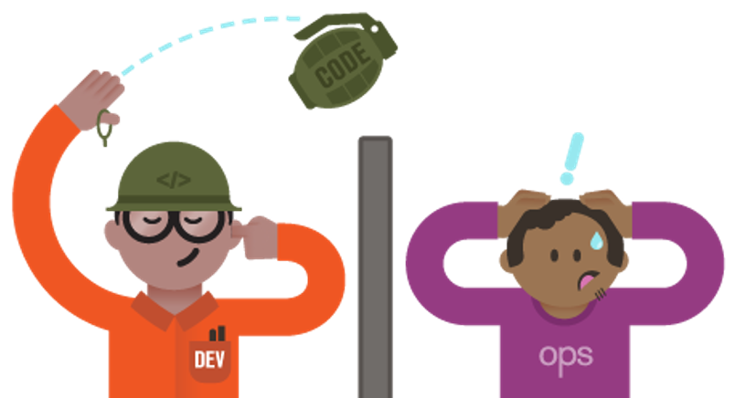
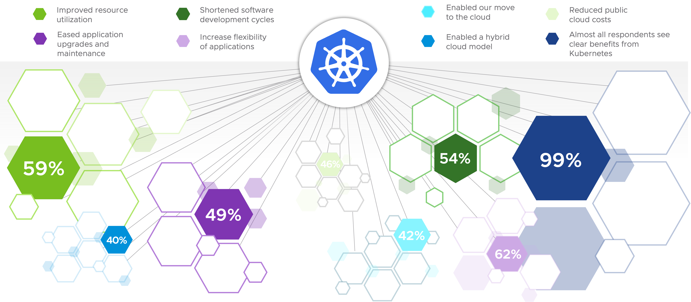
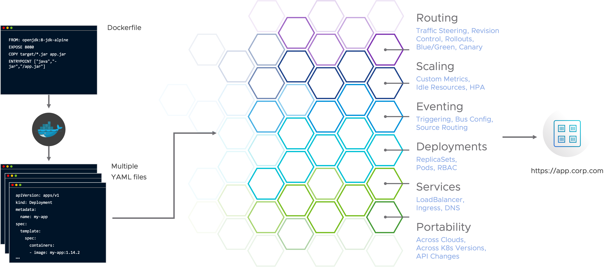
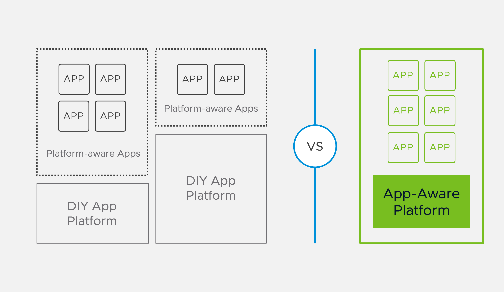

Before we dig into technology, let's see why you need them.

The **traditional software deployment process was really like the illustration**. 

The software application was handed over to an **operations department responsible for the deployment, day 2, and support**. 
**Long release cycles led to increased project risks and higher costs**. 
To address these issues, the **modern software development approach has transitioned towards Agile** methodologies and also **breaking down complex applications into smaller, loosely-coupled microservices implemented by smaller teams**. 

To **handle the more complex operations** of those applications, **more collaboration between developers and operations is required, known as DevOps culture**, which is **supported by automation and self-service** to minimize manual interactions. 

This **allows early and frequent software releases for fast feedback loops** and **requires rapid deployment and provisioning capabilities with CI/CD and for example Containers and Kubernetes**.

##### Containers and Kubernetes

You may already have heard that **Kubernetes is the new infrastructure abstraction standard**.
It's already commodity in the public cloud, and the same will happen on-premises.

More than 65% of organizations are already using Kubernetes in production, and others will start their infrastructure modernization journey soon to get **benefits like shortened software development cycles, and improved resource utilization**.

However, due to the complexity of Kubernetes and its ecosystem, **the move to Kubernetes is challenging for operators and developers**. 

It's important to know that **Kubernetes is a tool to build a platform** as the abstraction and capabilities it provides out of the box don't fulfill the needs of developers.

##### The Developer Experience GAP of DIY Container Platforms

Due to the **lack of user focus**, lots of DIY platforms at our customers have a big developer experience GAP.

That's not only because **building of Kubernetes platforms is complex**, also **deploying applications on Kubernetes requires expertise** in many Container and Kubernetes concepts. 

And once developers learned them, they still must spend a lot of time maintaining containers, writing YAML templates, and orchestrating many moving Kubernetes parts.

As with the traditional software deployment process illustrated below, **developers today shouldn't have to care where and how their applications are running** and focus on adding business value by implementing new features.

The idea of an **application-aware platform is to abstract away all those platform and infrastructure specifics** and give the developers an interface where they only have to define the requirements of the applications they want to deploy on the platform. 
The platform for example, then automatically builds a container image and applies platform best practices for the deployment. 
A well-known application-aware platform is Cloud Foundry, which is also part of the VMware Tanzu portfolio.

In the following sections, we will have a closer look at some of the powerful **open-source technologies** available within the Kubernetes ecosystem that will help you **get started in creating an application-aware platform based on Kubernetes**.

