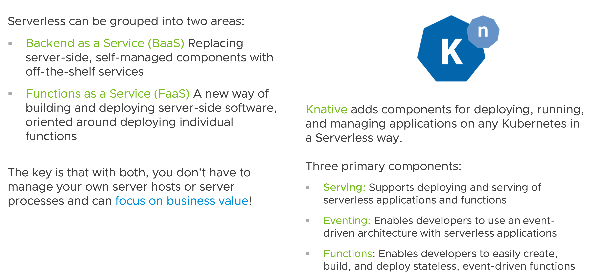

```terminal:interrupt
autostart: true
hidden: true
```
To deploy our application in a Kubernetes cluster with minimal configuration, we usually have to create a *Deployment*, and expose it with a *Service*, and an *Ingress* resource.

**Knative** simplifies deploying and operating microservices on Kubernetes. It provides a set of capabilities that enable developers to leverage the power of Kubernetes for **Serverless** use cases without first having to master the Kubernetes API.

##### Serverless

Before we have a closer look at Knative, let's get a common understanding of what Serverless is.


##### Knative

Knative is an open-source community project that provides a simple, consistent layer over Kubernetes that solves common problems of deploying software, connecting disparate systems together, upgrading software, observing software, routing traffic, and scaling automatically. 

The major subprojects of Knative are *Serving*, *Eventing*, and *Functions*.
- **Serving** is responsible for deploying, upgrading, routing, and scaling. 
- **Eventing** is responsible for connecting disparate systems. Dividing responsibilities this way allows each to be developed more independently and rapidly by the Knative community.
- **Functions** enables developers to easily create, build, and deploy stateless, event-driven functions.

##### Knative Serving
Knative Serving abstracts away a lot of the Kubernetes resources, like a deployment, service, ingress, etc., we usually have to configure to get an application running on Kubernetes. In addition to auto-scaling, it offers features like rollbacks, canary and blue-green deployment via revisions, and traffic splitting. 

Knative Serving defines four objects that are used to define and control how a serverless workload behaves on the cluster: *Service*, *Configuration*, *Revision*, and *Route*.

**Configuration** is the statement of what the running system should look like. You provide details about the desired container image, environment variables, and the like. Knative converts this information into lower-level Kubernetes concepts like *Deployments*. In fact, those of you with some Kubernetes familiarity might be wondering what Knative is adding. After all, you can just create and submit a *Deployment* yourself, no need to use another component for that.

Which takes us to **Revisions**. These are snapshots of a *Configuration*. Each time that you change a *Configuration*, Knative first creates a *Revision*, and in fact, it is the *Revision* that is converted into lower-level primitives.
It's the ability to selectively target traffic that makes *Revisions* a necessity. In vanilla Kubernetes, you can roll forward and roll back, but you can't do so with traffic. You can only do it with instances of the Service.

A **Route** maps a network endpoint to one or more *Revisions*. You can manage the traffic in several ways, including fractional traffic and named routes.

A **Service** combines a *Configuration* and a *Route*. This compounding makes common cases easier because everything you will need to know is in one place.

Let's use the **kn CLI** for Knative, to create a Knative Serving Service for our application.
```terminal:execute
command: kn service create inclusion --image {{ registry_host }}/inclusion
clear: true       
```

To test our deployment click on the output of the following command after the deployment is ready to serve traffic.
```terminal:execute
command: kn service describe inclusion -o url
clear: true
```

Let's also have a look at the Kubernetes custom resources.
```terminal:execute
command: kubectl eksporter services.serving.knative.dev
clear: true
```

###### Autoscaling
Scale to zero is enabled by default, but you don't always need it. 

You can configure the autoscaling of your applications via the **min-scale** and **max-scale** annotations on a *Service* or a *Revision*.
For a *Revision* you can do that with the `kubectl annotate` command.
For a *Service* resource, the annotation has to be set in the *RevisionTemplateSpec*.

Another option is to set the annotation via the kn CLI ...
```terminal:execute
command: kn service update inclusion --annotation autoscaling.knative.dev/min-scale=2
clear: true
```
```terminal:execute
command: kubectl get pods
clear: true
```

There are several other configuration options to tweak the autoscaler available, which we will not cover here, and the Knative Pod Autoscaler isn't the only autoscaler you can use with Knative Serving, it's just the one you get by default. Out of the box, you can e.g. also use the Horizontal Pod Autoscaler (HPA), which is a subproject of the Kubernetes project. 


