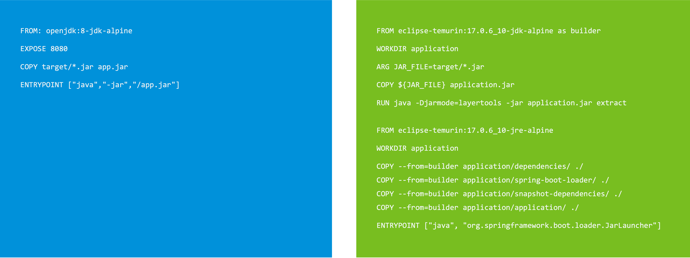

To be able to get all the benefits for our application Kubernetes provides, we have to containerize it.

The most obvious way to do this is to write a Dockerfile, run `docker build`, and push it to the container registry of our choice via `docker push`.


As you can see, in general, it is relatively easy and requires little effort to containerize an application, but whether you should go into production with it is another question because it is hard to create an optimized and secure container image (or Dockerfile).



To improve container image creation, **Buildpacks** were conceived by Heroku in 2011. Since then, they have been adopted by Cloud Foundry and other PaaS.
The new generation of buildpacks, the [Cloud Native Buildpacks](https://buildpacks.io), is an incubating project in the CNCF which was initiated by Pivotal (now part of VMware) and Heroku in 2018.

Cloud Native Buildpacks (CNBs) detect what is needed to compile and run an application based on the application's source code. 
The application is then compiled and packaged in a container image with best practices in mind by the appropriate buildpack.

The biggest benefits of CNBs are increased security, minimized risk, and increased developer productivity because they don't need to care much about the details of how to build a container.

With all the benefits of Cloud Native Buildpacks, one of the **biggest challenges with container images still is to keep the operating system, used libraries, etc. up-to-date** in order to minimize attack vectors by CVEs.

With [kpack](https://github.com/buildpacks-community/kpack), it's possible **automatically recreate and push an updated container image to the target registry if there is a new version of the buildpack or the base operating system available** (e.g. due to a CVE).


The custom `Image` resource provides all configurations required for kpack to build and maintain a container image utilizing Cloud Native Buildpacks.


It references a **(Cluster)Builder** resource which allows granular control of how stacks of base images, buildpacks, and buildpack versions are utilized and updated.
```execute
kubectl eksporter clusterbuilder default
```

There is also the [kp CLI](https://github.com/vmware-tanzu/kpack-cli) available for more human-friendly output, which you can try in the workshop environment. 
Here are some sample commands, and you can also trigger a new build via `kp trigger image payment-service` with the right privileges.
```execute
kp image list
```
```execute
kp image status payment-service
```
```execute
kp build list payment-service
```


**--- TMP**

**To run the controller in a Kubernetes cluster, we first have to build a container**. 
Spring Boot version 2.3.0 introduced **Cloud Native Buildpack** support to simplify container image creation.

Buildpacks were first conceived by Heroku in 2011. Since then, they have been adopted by Cloud Foundry and other PaaS.
And the new generation of buildpacks, the [Cloud Native Buildpacks](https://buildpacks.io), is an incubating project in the CNCF which was initiated by Pivotal and Heroku in 2018.

Cloud Native Buildpacks (CNBs) **detect what is needed to compile and run an application** based on the application's source code.
The application is then **compiled by the appropriate buildpack, and a container image with best practices in mind is built** with the runtime environment.

The biggest benefits of CNBs are **increased security, minimized risk, and increased developer productivity** because they don't need to care much about the details of how to build a container.

With Spring Boot 2.3 and later, you can create a container image using the open-source [Paketo buildpacks](https://paketo.io) with the following commands for Maven and Gradle.
```
./mvnw spring-boot:build-image -Dspring-boot.build-image.imageName=myorg/myapp
./gradlew bootBuildImage --imageName=myorg/myapp
```

In our case, we can run the following command to build the container image.
```terminal:execute
command: (cd ~/controller/ && ./gradlew bootBuildImage --imageName={{ registry_host }}/foo-controller)
clear: true
```

As soon as the image is created, we can have a look at it in our local Docker environment.
```terminal:execute
command: docker images
clear: true
```

To make it consumable by our Kubernetes cluster, the next step is to push it to a remote container registry.
```terminal:execute
command: docker push {{ registry_host }}/foo-controller
clear: true
```

Now we are finally ready to define the Kubernetes resources to run our custom controller on Kubernetes. In addition to the `Deployment` resource configured with the built container image, we also **have to assign cluster-wide privileges required for running our controller to the related `ServiceAccount`**, depending on the functionality implemented in the Reconciler. As no specific service account is defined in the deployment spec, the default service account in the default namespace will be used. 

```editor:append-lines-to-file
file: ~/controller-deployment.yaml
description: Create controller deployment resources
text: |2
  apiVersion: rbac.authorization.k8s.io/v1
  kind: ClusterRole
  metadata:
    name: foo-controller-cr
  rules:
    - apiGroups: [spring.io]
      resources: [foos]
      verbs: [get, list, watch]
    - apiGroups: [""]
      resources: [configmaps]
      verbs: [get, list, create, update]  
    - apiGroups: [apps]
      resources: [deployments]
      verbs: [get, list, create, update]  
  ---
  apiVersion: rbac.authorization.k8s.io/v1
  kind: ClusterRoleBinding
  metadata:
    name: foo-controller-crb
  subjects:
    - kind: ServiceAccount
      name: default
      namespace: default
  roleRef:
    apiGroup: rbac.authorization.k8s.io
    kind: ClusterRole
    name: foo-controller-cr
  ---
  apiVersion: apps/v1
  kind: Deployment
  metadata:
    name: foo-controller
    namespace: default
  spec:
    replicas: 1
    selector:
      matchLabels:
        app: foo-controller
    template:
      metadata:
        labels:
          app: foo-controller
      spec:
        containers:
        - image: {{ registry_host }}/foo-controller
          name: foo-controller
```

Let's apply the resources and discover our first Foo.
```terminal:execute
command: |
    kubectl create -f controller-deployment.yaml
```
```terminal:execute
command: kubectl get foos,configmap,deployment
clear: true
```

To be able to discover our first Foo from outside of the cluster, we'll now create a `Service`. With a service of type `LoadBalancer` we would be able to directly access it via an external IP. **In this case, it will be of type `ClusterIp` and externally exposed via an ingress controller.**
```terminal:execute
command: kubectl expose deployment my-first-foo --port=80 --target-port=80
clear: true
```
**The `Ingress` resource is already created for you.** By clicking on the following action, a new tab will open, targeting your first Foo at `https://my-first-foo-{{ session_namespace }}.{{ ingress_domain }}`.
```dashboard:create-dashboard
name: My first Foo
url: https://my-first-foo-{{ session_namespace }}.{{ ingress_domain }}
```